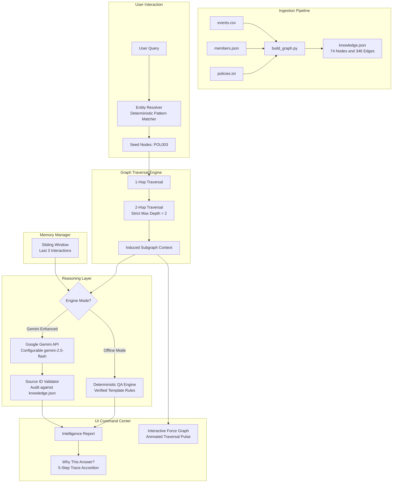

# Campus Collective — Knowledge Graph & AI QA Engine

> **Interactive Campus Intelligence System & Graph-Grounded QA Engine**  
> *Built for GDG on Campus Student Lead Organizer Assessment*

---

## 1. Problem

University student clubs and technical committees manage extensive operational knowledge across disparate, unlinked silos:
- Workshop schedules and attendance logs in spreadsheet exports (`events.csv`)
- Leadership rosters, domains, and active projects in structured records (`members.json`)
- Committee governance, funding caps, and approval workflows in unstructured text files (`policies.txt`)

When organizers or students need answers to high-stakes operational queries—such as *"Who must approve restricted GPU cluster access?"* or *"Who gives final sign-off for events over 100 attendees?"*—generic chatbots fail because they:
1. Suffer from hallucinations and confabulations.
2. Lack access to structured relational constraints and multi-hop paths.
3. Cannot provide verifiable source attribution or audit trails.

---

## 2. Solution

**Campus Collective** is a Palantir-style intelligence command center where the **knowledge graph itself is the primary interface**.

Instead of treating an LLM as a database, Campus Collective strictly implements:
> **Deterministic retrieval first, probabilistic reasoning second.**

1. Ingests all heterogeneous campus data into an audited NetworkX knowledge graph (`knowledge.json`).
2. Performs deterministic entity resolution to locate exact seed nodes.
3. Executes a strict **2-hop breadth-first traversal** to extract the minimal induced context subgraph.
4. Maintains an in-memory sliding window of the **last 3 interactions**.
5. Prompts Google Gemini with *only* the retrieved 2-hop context and conversation memory.
6. Performs automated source-ID validation against `knowledge.json`, dropping hallucinations.
7. Visually animates the traversal across an interactive physics-simulated graph canvas.
8. Displays verified evidence cards and a 5-step "Why This Answer?" explanation breakdown.

---

## 3. Architecture



---

## 4. Knowledge Graph

The graph is compiled deterministically by `build_graph.py` and stored in `knowledge.json`.

### Node Types (74 Total)
- **10 Members** (`M001`–`M010`): Committee Chair, Leads, Officers, Coordinators.
- **35 Events** (`E001`–`E035`): Workshops, hackathons, seminars, bootcamps.
- **10 Domains** (`D_AI_ML`, `D_CLOUD`, `D_WEB_DEV`, `D_CYBERSECURITY`, `D_ROBOTICS`, `D_IOT`, `D_DATA_SCIENCE`, `D_BUDGET_FINANCE`, `D_GOVERNANCE`, `D_DEVOPS`).
- **14 Projects** (`P_CAMPUS_AI_LAB_SETUP`, `P_CLOUD_CREDITS_PROGRAM`, `P_HACKATHON_2026`, etc.).
- **5 Policies** (`POL001`–`POL005`): Venue Booking, Budget Limits, Lab Hardware Access, Event Approval, Cross-Domain Collaboration.

### Relationships (346 Bidirectional Edges)
Every forward relationship has an explicit inverse edge with complete provenance:
- `Member` — `LEADS` / `LED_BY` → `Event`
- `Member` — `MEMBER_OF` / `HAS_MEMBER` → `Domain`
- `Member` — `WORKS_ON` / `OWNED_BY` → `Project`
- `Event` — `BELONGS_TO` / `HAS_EVENT` → `Domain`
- `Event` — `PART_OF_PROJECT` / `HAS_EVENT` → `Project`
- `Policy` — `MANAGED_BY` / `MANAGES` → `Member`
- `Policy` — `FINAL_APPROVER` / `FINAL_APPROVER_OF` → `Member`
- `Policy` — `JOINT_APPROVER` / `JOINT_APPROVER_OF` → `Member`
- `Policy` — `TECHNICAL_REVIEWER` / `REVIEWS_FOR` → `Member`
- `Policy` — `APPLIES_TO` / `HAS_POLICY` → `Domain`
- `Policy` — `MENTIONS` / `GOVERNED_BY` → `Event` / `Project`

### Provenance Tracking
Every node specifies its source file (`"source": "members.json"`), and every edge specifies its source file (`"source_file": "policies.txt"`), ensuring full auditability.

---

## 5. Strict 2-Hop Retrieval Engine

Located in `backend/services/retriever.py`:
- BFS traversal strictly bounded by `max_hops = 2`.
- Seeds are set to `depth = 0`.
- 1-hop neighbors are recorded at `depth = 1`.
- 2-hop neighbors are recorded at `depth = 2`.
- Traversal terminates immediately; depth 3+ is strictly forbidden.
- Output includes complete `retrieval_trace`:
  ```text
  POL003 (depth=0)
    ↓ MANAGED_BY (depth=1)
  M008 Karan Malhotra
    ↓ JOINT_APPROVER (depth=1)
  M003 Sneha Iyer
  ```

---

## 6. Gemini Grounding

Located in `backend/services/gemini_service.py`:
- **System Instruction**: Explicitly instructs Gemini that the local graph is the sole source of truth and strictly prohibits hallucinating members, relationships, or dates.
- **Payload Minimization**: Sends only the retrieved 2-hop subgraph and conversation memory. Never dumps the entire graph.
- **Structured Schema Enforcement**: Forces JSON response with `answer`, `source_node_ids`, `confidence`, and `reasoning_summary`.
- **Configurable Model**: Configured via `GEMINI_MODEL=gemini-2.5-flash` in `.env`.

---

## 7. Offline-First Design

Campus Collective functions seamlessly without an external LLM:
- **OFFLINE ENGINE**: Deterministic query evaluator in `backend/services/offline_qa.py` parses graph relations directly to generate accurate operational answers with source attribution.
- **Graceful Fallback**: If Gemini encounters rate limits, timeouts, network loss, or an invalid API key, the system automatically falls back to the Offline Engine without crashing or throwing unhandled errors.

---

## 8. Short-Term Memory

Located in `backend/services/memory.py`:
- In-memory circular buffer storing exactly the **last 3 interactions**:
  ```json
  {
    "query": "...",
    "answer": "...",
    "source_node_ids": ["..."],
    "timestamp": "..."
  }
  ```
- Adding a fourth interaction automatically evicts the oldest item.
- Displayed persistently in the top bar (`MEMORY 3 / 3`).
- User can instantly clear memory via the UI or `POST /api/memory/clear`.

---

## 9. Source Validation

Located in `backend/services/validator.py`:
- Never blindly accepts source IDs generated by an LLM.
- Cross-references all returned `source_node_ids` against the set of valid graph node IDs in `knowledge.json`.
- If an invalid or hallucinated ID is encountered:
  1. It is automatically purged from the response.
  2. The response is flagged with `verification_status: "WARNING"`.
  3. The "Why This Answer?" panel explains which IDs were rejected.

---

## 10. Technology Stack

| Layer | Technology | Purpose |
|---|---|---|
| **Frontend** | React 18 / 19, TypeScript, Vite | Command center UI & state management |
| **Styling** | Tailwind CSS v4, Lucide Icons | Dark command center theme (`#0B0B12`, `#14131D`) |
| **Graph Canvas**| HTML5 Canvas Force-Directed Engine | 60 FPS physics floating simulation, zoom/pan, minimap |
| **Backend** | FastAPI, Uvicorn, Python 3.12 | High-throughput async REST API |
| **Graph Engine**| NetworkX DiGraph | In-memory graph traversal, degree & topology queries |
| **Reasoning** | Google Gemini API (`google-genai`) | Grounded reasoning over 2-hop context |
| **Data Formats**| CSV, JSON, TXT | Ingestion and persistent graph artifact |
| **Container** | Docker, Google Cloud Run | Production deployment |

---

## 11. Project Structure

```text
campus-collective/
├── backend/
│   ├── main.py                      # FastAPI REST application
│   ├── requirements.txt             # Python dependencies
│   ├── models/
│   │   ├── graph.py                 # Node, Edge, Subgraph, Health models
│   │   └── query.py                 # QueryRequest, QueryResponse, Evidence models
│   └── services/
│       ├── ingestion.py             # Raw data parser with provenance
│       ├── graph_builder.py         # NetworkX DiGraph manager
│       ├── validator.py             # Graph & source validation service
│       ├── entity_resolver.py       # Deterministic query resolver
│       ├── retriever.py             # Strict 2-hop BFS engine
│       ├── memory.py                # 3-turn short-term memory buffer
│       ├── offline_qa.py            # Deterministic template QA engine
│       ├── gemini_service.py        # Google Gemini API adapter
│       └── qa_engine.py             # Retrieval & QA orchestrator
├── data/
│   ├── events.csv                   # 35 technical campus events
│   ├── members.json                 # 10 committee members & projects
│   └── policies.txt                 # 5 committee operational policies
├── frontend/
│   ├── src/
│   │   ├── components/
│   │   │   ├── graph/GraphCanvas.tsx# Force simulation with floating nodes & minimap
│   │   │   ├── graph/NodeDetails.tsx# Slide-out node inspector
│   │   │   └── layout/              # Sidebar & Topbar components
│   │   ├── pages/
│   │   │   ├── CommandCenter.tsx    # Operational metrics & domain breakdown
│   │   │   ├── KnowledgeExplorer.tsx# Fullscreen interactive graph canvas
│   │   │   ├── QueryConsole.tsx     # Query trace & intelligence reports
│   │   │   ├── EventIntelligence.tsx# 35 events table & focus-in-graph
│   │   │   ├── PolicyCenter.tsx     # POL001-POL005 rule inspector
│   │   │   └── Diagnostics.tsx      # Integrity audit & benchmark test runner
│   │   ├── services/api.ts          # Frontend REST client
│   │   ├── types/index.ts           # TypeScript interfaces
│   │   ├── utils/colors.ts          # Color tokens
│   │   ├── App.tsx                  # Root routing & state orchestration
│   │   └── main.tsx                 # Entrypoint
│   ├── package.json
│   ├── tailwind.config.js
│   └── vite.config.ts
├── build_graph.py                   # Graph construction pipeline
├── knowledge.json                   # Verified knowledge graph
├── Dockerfile                       # Multi-stage Cloud Run container
├── docker-compose.yml               # Local container orchestration
├── .env.example                     # Environment configuration template
├── .gitignore                       # Git ignore rules
└── README.md                        # Documentation
```

---

## 12. Installation & Running Locally

### Prerequisites
- Python 3.10+
- Node.js 18+ and npm

### 1. Rebuild Knowledge Graph
```bash
python build_graph.py
```
Outputs `knowledge.json` containing 74 nodes and 346 edges.

### 2. Run Backend
```bash
# Optional: Set up virtual environment
python -m venv .venv
source .venv/bin/activate  # On Windows: .venv\Scripts\activate

# Install dependencies
pip install -r backend/requirements.txt

# Configure environment
cp .env.example .env
# Edit .env and set your GEMINI_API_KEY (optional)

# Start FastAPI server
python -m uvicorn backend.main:app --host 0.0.0.0 --port 8000 --reload
```
API runs on `http://localhost:8000` (docs at `http://localhost:8000/docs`).

### 3. Run Frontend
In a separate terminal:
```bash
cd frontend
npm install
npm run dev
```
Frontend runs on `http://localhost:5173`.

---

## 13. Running with Docker Compose

```bash
docker-compose up --build
```
- Frontend: `http://localhost:5173`
- Backend: `http://localhost:8000`

---

## 14. Deploying to Google Cloud Run

```bash
# 1. Set Google Cloud project
gcloud config set project YOUR_PROJECT_ID

# 2. Build and push container to Google Artifact Registry
gcloud builds submit --tag gcr.io/YOUR_PROJECT_ID/campus-collective

# 3. Deploy to Cloud Run
gcloud run deploy campus-collective \
  --image gcr.io/YOUR_PROJECT_ID/campus-collective \
  --platform managed \
  --region us-central1 \
  --allow-unauthenticated \
  --set-env-vars GEMINI_API_KEY=your_key_here,GEMINI_MODEL=gemini-2.5-flash
```

---

## 15. Benchmark Demo Queries

Test these 5 queries in the Query Console or via `/api/query`:

| Query | Expected Seed | Expected Verified Sources | Answer Summary |
|---|---|---|---|
| **"Who must approve restricted GPU access?"** | `POL003` | `POL003`, `M008`, `M003` | Joint approval from Karan Malhotra (M008) and Sneha Iyer (M003). |
| **"Who leads AI/ML events?"** | `D_AI_ML` | `M003`, `D_AI_ML`, `E001` | AI/ML Lead Sneha Iyer (M003) organizes core workshops. |
| **"Who is the cloud lead?"** | `M004` | `M004`, `D_CLOUD` | Cloud Lead Vikram Nair (M004) oversees DevOps & Cloud. |
| **"Who gives final approval for events above 100 attendees?"** | `POL004` | `POL004`, `M001` | Committee Chair Ananya Roy (M001) holds final sign-off authority. |
| **"Who manages robotics lab access?"** | `POL003` | `POL003`, `M008`, `D_ROBOTICS` | Lab Coordinator Karan Malhotra (M008) oversees access tiers. |

---

## 16. Evaluation & Diagnostics

The Diagnostics page (`/api/diagnostics`) executes continuous dynamic validation:
- **0 Orphan Nodes**: Degree of every node is at least 2.
- **0 Broken References**: All edge targets and sources resolve to valid nodes.
- **0 Duplicate IDs**: Uniqueness enforced across all 5 entity types.
- **100% Reverse-Edge Consistency**: All relationships are strictly bidirectional.
- **Latency Benchmark**: Deterministic 2-hop retrieval executes in **< 5 milliseconds**.

---

## 17. Future Improvements

1. **Vector-Augmented Graph Retrieval (GraphRAG)**: Compute hybrid BM25 + cosine embeddings over node property texts.
2. **Community Detection**: Implement Louvain or Leiden clustering to visualize emergent student research sub-clusters.
3. **Role-Based Access Control (RBAC)**: Enforce authenticated committee permissions for policy modifications.
